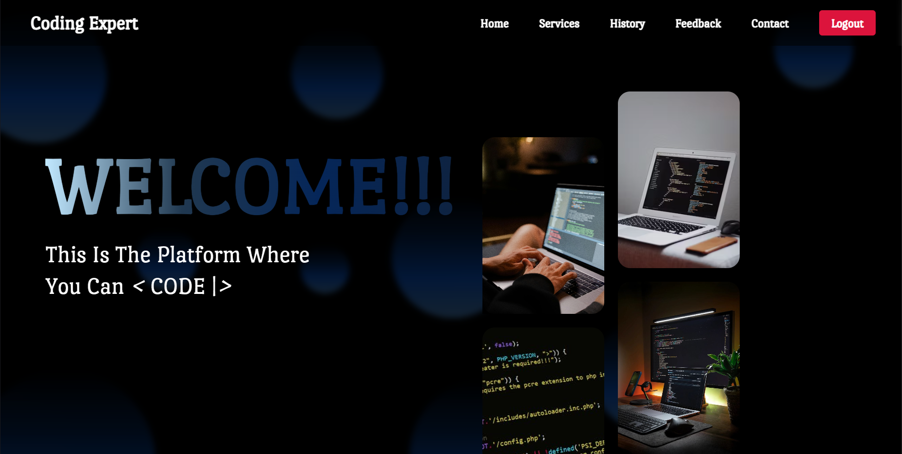
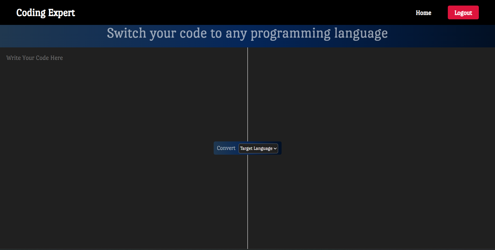

# 🚀 AI-Powered Code Developer Toolkit (CodeExpert)

> A full-stack web application that leverages Google's Gemini AI to assist developers with code conversion, debugging, optimization, and documentation.



## 📖 Overview

The **AI-Powered Code Developer Toolkit** is a comprehensive SaaS-style application designed to streamline the coding workflow. It provides a suite of intelligent tools that allow users to input code snippets and receive AI-generated improvements instantly.

Built with **Spring Boot** for a robust backend and **MySQL** for persistent history tracking, the application integrates the **Google Gemini API** to perform complex natural language processing tasks on code.

## ✨ Key Features

* **🔐 User Authentication:** Secure Login and Registration system to manage user access.
* **🔄 Code Converter:** Instantly translate code from one language (e.g., Python) to another (e.g., Java).
* **🐞 Intelligent Debugger:** Detects errors, explains bugs, and provides corrected code snippets.
* **⚡ Code Optimizer:** Analyzes algorithms for time/space complexity and suggests efficiency improvements.
* **📝 Auto-Documentation:** Generates professional comments and documentation for complex functions.
* **🧹 Code Organizer:** Formats and beautifies messy code for better readability.
* **stmt User History:** Persists all generated code and AI responses to a MySQL database, allowing users to review their past activity.

## 🛠️ Tech Stack

**Backend**
* 
* 
* 
* 

**Frontend**
* 
* 
* 

**AI & APIs**
* **Google Gemini API:** (Model: `gemini-1.5-flash`) for generative AI tasks.
* **Jackson:** For JSON parsing and processing.

## 🏗️ Architecture

The project follows a standard **Layered Architecture (MVC)**:
1.  **Controller Layer:** Exposes REST API endpoints (`/api/ai`, `/api/users`, `/api/history`).
2.  **Service Layer:** Contains business logic and handles API communication via `RestTemplate`.
3.  **Repository Layer:** Manages data access using Spring Data JPA.
4.  **Database:** MySQL relational database with One-to-Many mapping (Users -> History).

## 🚀 Getting Started

Follow these instructions to set up the project locally.

### Prerequisites
* Java Development Kit (JDK) 17 or higher
* Maven
* MySQL Server
* A Google Cloud API Key (for Gemini)

### Installation

1.  **Clone the repository**
    ```bash
    git clone https://github.com/Abhishek-Bajetha/CodeExpert.git
    cd CodeExpert
    ```

2.  **Configure the Database**
    * Open MySQL Workbench and create a database:
        ```sql
        CREATE DATABASE code_expert_db;
        ```
    * Open `src/main/resources/application.properties` and update your credentials:
        ```properties
        spring.datasource.url=jdbc:mysql://localhost:3306/code_expert_db
        spring.datasource.username=YOUR_MYSQL_USERNAME
        spring.datasource.password=YOUR_MYSQL_PASSWORD
        spring.jpa.hibernate.ddl-auto=update
        ```

3.  **Configure the AI Key**
    * In `application.properties`, add your Google Gemini API key:
        ```properties
        gemini.api.key=YOUR_GOOGLE_API_KEY
        gemini.api.url=https://generativelanguage.googleapis.com/v1beta/models/gemini-1.5-flash:generateContent?key=
        ```

4.  **Run the Application**
    ```bash
    mvn spring-boot:run
    ```

5.  **Launch the Frontend**
    * Navigate to the `/frontend` folder.
    * Open `login.html` in your browser (or use VS Code Live Server).

## 🔌 API Endpoints

| Method | Endpoint | Description |
| :--- | :--- | :--- |
| `POST` | `/api/users/register` | Register a new user account |
| `POST` | `/api/users/login` | Authenticate existing user |
| `POST` | `/api/ai/generate` | Send prompt to Gemini and save to history |
| `GET` | `/api/history/{userId}` | Fetch full activity log for a specific user |

## 📸 Screenshots

### 1. Code Conversion Tool


### 2. User History Dashboard


## 🔮 Future Improvements

* **Security:** Implement JWT (JSON Web Tokens) for stateless session management.
* **Frontend Polish:** Add syntax highlighting (Prism.js) for code blocks.
* **Deployment:** Host the backend on Render/AWS and frontend on Vercel.

## 🤝 Contributing

Contributions are welcome! Please fork the repository and create a pull request.

## 📜 License

This project is licensed under the MIT License.

---

**Developed by Abhishek Bajetha**
*Connect with me on [LinkedIn](https://linkedin.com/in/abhishek-bajetha)*